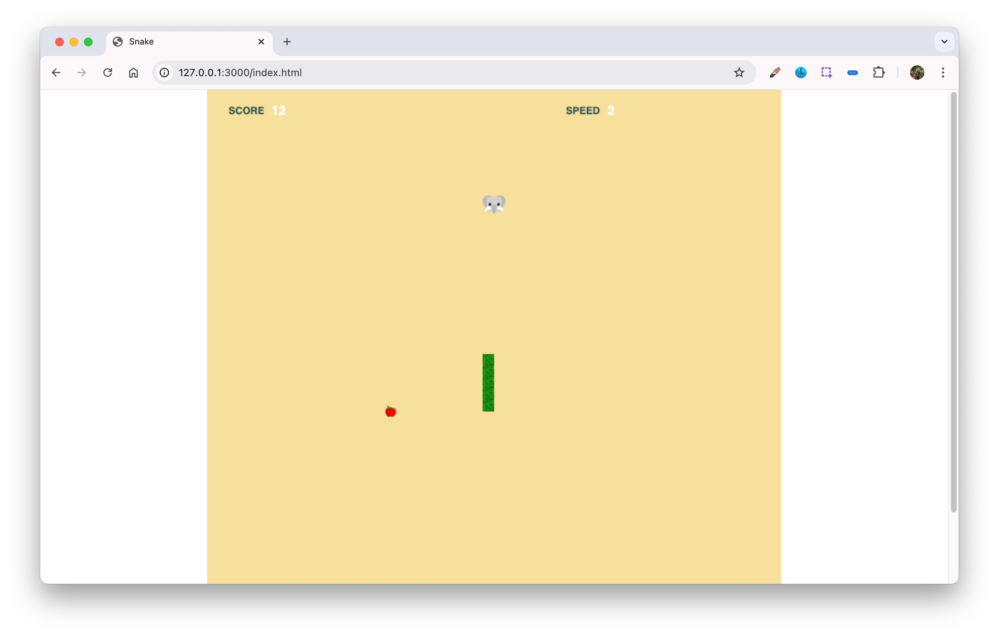

## Zensar Game Development course assignments 

### Problem statement 
Develop a simple Snake game using JavaScript and H5 and a game framework
such as Phaser.io.The game should include the following features:
1. A snake that can move in four directions (up, down, left, right) using the arrow
keys.
2. Food items that randomly appear on the game field.
3. The snake grows longer each time it eats a food item.
4. The game ends when the snake collides with itself or the walls.
5. A scoring system that tracks the number of food items eaten.

### Screenshot 

### Features 

Contains two goals apple and elephant 

- elephant can move continuously, on capture give 10 points and increases speed 
- apple is fixed, on capture +1 point 
- after 20 points speed is increased
